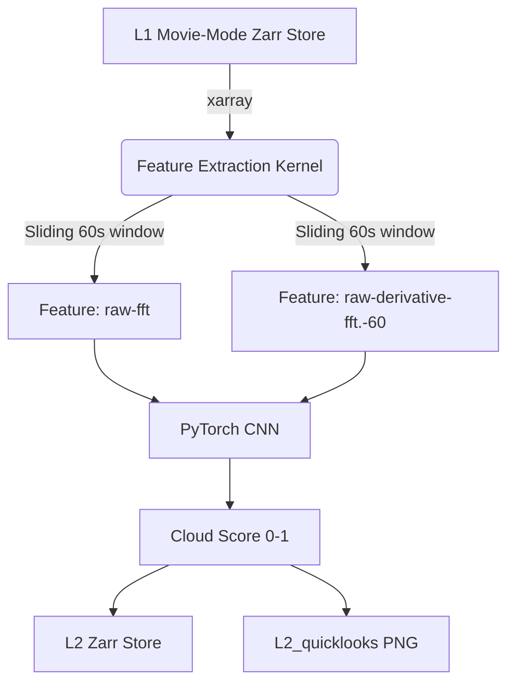
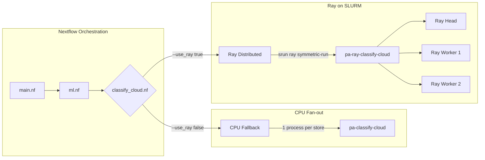

# Machine Learning Architecture & Pipelines

This document outlines the architecture of the Machine Learning workloads in `panoseti_analysis`, focusing primarily on the Cloud Detection inference pipeline, the Nextflow-to-Ray substrate, and future extensions.

**Model cards:** [Cloud Detector](../ml/cloud-detection/README.md) · [β-VAE Anomaly Detector](../ml/anomaly-detection/README.md)  
**Operational guides:** [Real-time Streaming (RAL)](streaming_ral.md) · [Training on RAL](training_ral.md)

## Data Flow & Inference Pipeline

The ML pipeline is architected around "Pure Kernels" (Layer A) that operate independently of any transport or orchestration framework, wrapped by thin CLI adapters (Layer B) that handle data loading and distribution.



### Feature Extraction

The feature extraction logic accurately reproduces the pipeline originally defined in the `panoseti-software/cloud-detection` repository:

1. **Cadence & Windowing**: Instead of rigid chunking, the pipeline uses a _rolling window_ parametrized by `cadence_s`. For any target time $T$, it looks back 60 seconds.
2. **Preprocessing**:
   - Uses a 2D Hann window (`np.hanning(32)`).
   - Computes `np.fft.fftn` and `np.fft.fftshift`.
   - Scales the FFT magnitude with `np.log()`.
3. **Integration**: The model expects input frames integrated over $1\text{ms}$. Since Panoseti `img` natively records at $100\mu\text{s}$, the kernel sums $10$ consecutive frames to produce the final `curr_img` and `prev_img` arrays before taking differences and FFTs.

## Execution Models: Nextflow + Ray

Because Python data-science libraries (like PyTorch and xarray) are notoriously difficult to parallelize cleanly via Nextflow alone (due to high initialization overhead and memory fragmentation), we support a dual-execution strategy: **CPU Fallback** and **Distributed Ray**.



### 1. CPU Fallback (`pa-classify-cloud`)

- **How it works**: Nextflow fans out `L1` stores, spawning one independent SLURM/local job per store. Each job boots a Python interpreter, loads the model, and runs inference.
- **Tradeoffs**: Extremely reliable and container-native, but suffers from high "cold-start" latency (loading PyTorch and model weights over the network for every single 1-minute data file).

### 2. Distributed Ray (`pa-ray-classify-cloud`)

- **How it works**: Nextflow groups all stores belonging to a single observation run and submits a _single_ `srun` job requesting multiple nodes. The `ray symmetric-run` wrapper bootstraps a transient Ray cluster across the SLURM allocation.
- **Tradeoffs**: The PyTorch model is loaded _once_ and cached in Ray's object store. Inference tasks are dispatched to workers continuously with near-zero overhead. This is the optimal route for large-scale "movie-mode" processing.

## Training System

### Overview

Training is **separate from Nextflow** — a multi-hour `TorchTrainer` loop fits Ray Train's checkpoint/restore model better than Nextflow's per-process resume. On RAL: `pa-train-cloud --launcher attach …` against the user's running cluster. Training produces a versioned model bundle that the Chunk 2 inference path consumes unchanged via `load_classifier`.

### Three-Mode Ray Launcher

`adapters/ray/launcher.py::init_ray(launcher)` selects the cluster strategy:

| Mode         | `ray.init(...)`                    | Cluster lifetime                | Use case      |
| ------------ | ---------------------------------- | ------------------------------- | ------------- |
| `attach`     | `address=$RAY_ADDRESS or "auto"`   | **Persistent, user-owned**      | RAL (default) |
| `slurm`      | `address="auto"` inside allocation | == SLURM allocation (transient) | Expanse       |
| `standalone` | local, real multi-process          | == the process                  | CI / laptop   |

The **transient-cluster invariant is SLURM-only.** On RAL the cluster outlives any job; on `standalone` it is process-local.

### Data Flow: L1 → Features → Training → Bundle

```
Nextflow ingest:  PFF → L0 → L1 (processing_history: [convert, calibrate])
                                 ↓
pa-features-cloud / pa-prep-ph:  L1 → features.<recipe_hash>.zarr  (BeeGFS)
                                          ↓ stage_to_local (SSD)
pa-train-cloud / pa-train-vae:          train on SSD ──→ model bundle (BeeGFS models/)
                                                                ↓
Nextflow --steps ml:                    L1 → L2 (load_classifier reads bundle)
```

### SSD Staging (1 GbE Mitigation)

`adapters/ray/_staging.py::stage_to_local(source, local_cache_dir)` copies the compact feature cache from BeeGFS to each GPU node's local SSD before training begins. Idempotent: skips if `checksum_store(dest) == checksum_store(source)`. GPU nodes (`a6k`, `gf`) each have 1 TB SSD; the labeled-subset feature cache fits comfortably.

### GPU Targeting

`ScalingConfig(use_gpu=True, accelerator_type="A6000")` routes training to the A6000 nodes by default. Set `accelerator_type: null` in the recipe to opt into all-4-GPU runs (includes the RTX 4070 / Blackwell 5070).

### Checkpointing

`RunConfig(storage_path=<beegfs_path>/ray_results, failure_config=FailureConfig(max_failures=3))`. Checkpoints land on BeeGFS shared FS so Ray can restore from the last checkpoint after a worker failure. The Ray v2 architecture reliability model: shared FS survives worker death; Ray restores automatically.

### Experiment Tracking

`adapters/ray/_tracking.py` exposes a thin `Tracker` interface (`.log(metrics)`, `.finish()`) implemented by `_WandbTracker` (online; `WANDB_MODE=offline` fallback for air-gapped nodes), `_TensorBoardTracker` (always-available local fallback), and `_NoOpTracker`. Tracking lives in Layer B adapters, never in Layer A kernels.

### Recipes vs Profiles

|                       | Recipes (`recipes/*.yml`)                                                      | Profiles (`-profile`)                            |
| --------------------- | ------------------------------------------------------------------------------ | ------------------------------------------------ |
| WHAT                  | Science params (feature params, split ratios, hyperparams, scaling, model_out) | WHERE/HOW (executor, container, resource limits) |
| Version-controlled    | Yes — `load_recipe(path) -> (params, name, recipe_hash)`                       | Yes — Nextflow profiles                          |
| Stamped in provenance | Yes — `recipe_name` + `recipe_hash` in every `ProcessingStep`                  | No                                               |

### Model Bundle Format

`save_classifier(model, bundle, training_provenance, out_dir)` writes:

- `<name>.pt` — PyTorch state dict
- `<name>.ClassifierBundle.json` — `load_classifier`-compatible sidecar with sha256 checksum
- `<name>_provenance.json` — `TrainingProvenance` block (recipe, hyperparams, metrics, git_sha, wandb_run_id)

The Chunk 2 inference path (`load_classifier`) consumes these bundles **unchanged**.

### Cloud Detector Retrain (`pa-train-cloud`)

Uses **2-channel features** (`raw_fft` + `deriv_fft`, matching inference) and the **temporal boundary-gap split** (`algorithms/splits.py::data_split`, seed=35) — fixes the original notebook's shuffled `train_test_split` which leaked near-duplicate adjacent frames. Default hyperparameters: lr 1e-3, Adam + wd 1e-5, batch 128, ExponentialLR γ=0.9 + ReduceLROnPlateau.

### PH BetaVAE (`pa-train-vae`)

`algorithms/ph_vae.py::BetaVAE(latent_dim=32, hidden_dim=64)` — pure PyTorch, input `(N, 1, 16, 16)`. Loss: `MSE(mean) + beta·KL(sum) + sparsity·L1(mu)`. Preprocessing (`pa-prep-ph`): L1 `pedestal_subtracted` → log-norm to unit range. Split seed=1984.

### Hyperparameter Tuning (Ray Tune)

`pa-tune-cloud` wraps `TorchTrainer` in a `Tuner` with ASHA scheduler. The recipe `tune:`
block defines the search space (`uniform`, `loguniform`, `choice`, `grid`, `randint`). See
[Training on RAL](training_ral.md#hyperparameter-sweep-ray-tune) for usage.

---

## Real-Time Streaming Pipeline (Chunk 4)

The streaming path runs alongside or independently of the batch pipeline, producing
**per-minute cloud scores in real time** from the live DAQ stream without round-tripping
data through Zarr on disk.

### Architecture

```
simulate.py / Hashpipe (UDS)
        │ PFF frames
        ▼
panoseti_grpc DaqData server ── StreamImages ──► StreamConsumer (async grpc client)
                                                        │ (module_id, dp, frame[32,32], unix_t_ns)
                                                        ▼
                                              FrameAccumulator (Ray actor, per module+dp)
                                                        │ rolling buffer + progressive calibrate_img
                                                        │ emit when ≥60s span, every cadence_s
                                                        ▼ xr.Dataset {median_subtracted, unix_t_ns}
                                              CloudInferDeployment (Ray Serve, gaming GPU)
                                                        │ predict_cloud_score (Layer A kernel)
                                                   ┌────┴─────────────┐
                                                   ▼                  ▼
                                          MLInference gRPC        Telemetry → Redis
                                          (EmitPrediction)        (log_flexible → Grafana)
                                                   │
                                        flagged windows-of-interest
                                                   ▼
                                          L2 Zarr archive (write_store + processing_history)
```

### Key components

| File                                   | Role                                                                                                                                                               |
| -------------------------------------- | ------------------------------------------------------------------------------------------------------------------------------------------------------------------ |
| `adapters/stream/consumer.py`          | Async `StreamImages` consumer; extracts per-frame ns timestamp from header Struct (16×16/32×32 both handled); routes frames to `FrameAccumulator` actors           |
| `adapters/stream/accumulator.py`       | `@ray.remote FrameAccumulator`; rolling buffer + progressive rolling-median calibration; calls `calibrate_img` + `predict_cloud_score`; emits via gRPC + telemetry |
| `adapters/stream/serve_app.py`         | `@serve.deployment CloudInferDeployment`; loads model bundle once; pinned to gaming node (`accelerator_type:GAMING`) to keep A6000s for training                   |
| `adapters/stream/cli.py`               | `pa-stream-cloud` typer CLI; init_ray(attach) + deploy Serve + run consumer                                                                                        |
| `grpc/src/panoseti_grpc/ml_inference/` | Thin gRPC pub-sub broker (no ML logic); `EmitPrediction` fans predictions out to `StreamPredictions` / `SubscribeAlerts` subscribers                               |

### Progressive calibration (cold-start behaviour)

The accumulator uses `calibrate_img` over the rolling buffer as a progressive pedestal
estimate (rolling median). Early in the night this underestimates the real pedestal.
Each `Prediction` carries a `calibration_maturity` field (0=cold, 1=warm) so downstream
consumers can discount early-night windows. **End-to-end streaming scores will not
byte-match batch L2** — by design. The equivalence keystone
(`tests/adapters/test_stream_consumer.py::TestEquivalenceKeystone`) proves that:

1. **Kernel outputs are bit-identical** across CLI / Ray task / gRPC-Serve paths given the
   _same_ Dataset (transport-independence).
2. **Calibration drift is small but non-zero** (measured MAE ≈ 0.0002 for a 300-frame half-window
   vs full-batch median).

### GPU placement

| Node                             | Resource tag           | Use                                        |
| -------------------------------- | ---------------------- | ------------------------------------------ |
| `digilab-receiver` (`10.0.1.14`) | `accelerator_type:A6000`  | Training (reserved)                        |
| `digilab-transmit` (`10.0.1.34`) | `accelerator_type:GAMING` | Serving (CloudInferDeployment pinned here) |
| `panoseti-dfs{0,1,2}`            | none                      | CPU fan-out, data pipeline                 |

Pin serving to the gaming node: `ray_actor_options={"num_gpus": 1, "resources": {"accelerator_type:GAMING": 0.001}}`.
Labels are set explicitly by `cluster/ral_up.sh` (not Ray auto-detection).
The Blackwell RTX 5070 requires CUDA ≥12.8 — confirmed available (drp env: cu130).

### Running the streaming pipeline

```bash
# 1. Start the panoseti_grpc unified server with MLInference enabled.
#    Edit server.toml: services.ml_inference = true  (or use a custom config)
pseti-grpc server --config /path/to/server.toml

# 2. (Optional) Start a simulate.py replay for testing with archived PFF data:
#    (done internally by panoseti_grpc when daq_data.simulate_daq_cfg is set)

# 3. Run the streaming pipeline (attach mode, gaming GPU, 60s cadence):
pa-stream-cloud \
    --model-path assets/models/cloud_detector_v1.pt \
    --recipe recipes/ml/stream_cloud_v1.yml \
    --grpc-host localhost \
    --archive-dir /mnt/beegfs/streams/

# 4. (Optional) Subscribe to live predictions from another terminal:
python -c "
from panoseti_grpc.ml_inference.client import MLInferenceClient
with MLInferenceClient() as c:
    for p in c.stream_predictions():
        print(p.module_id, p.cloud_score, p.cloud_label)
"
```

### ML gRPC service

New proto: `grpc/protos/ml_inference.proto` (package `panoseti.ml`, branch `feat/ml-inference-service`).

| RPC                 | Direction              | Description                                            |
| ------------------- | ---------------------- | ------------------------------------------------------ |
| `EmitPrediction`    | accumulator → servicer | Push one scored window                                 |
| `StreamPredictions` | client ← servicer      | Live stream of all scores (filterable by module/model) |
| `SubscribeAlerts`   | client ← servicer      | Only cloud-detected events (score ≥ alert_threshold)   |

Seams (commented, unimplemented): `TriggerCapture`, `MLInterrupt`, `MountControl`.

Enable in the unified server: `services.ml_inference = true` in `server.toml`.

### Streaming provenance

- **Lightweight in-memory tags** on every `Prediction` proto: `model_name`, `model_version`,
  model `checksum`, `recipe_hash`, `git_sha`, `calibration_maturity`.
- **Full `processing_history` on archived windows-of-interest** (cloud-flagged windows):
  `write_store(ds_l2, archive_dir/..., processing_history=[ProcessingStep(...)])` writes the
  full chain (step_name="stream_cloud_infer", model provenance, recipe_hash, software) into
  Zarr root attrs, then the store is PACK'd to ZipStore for the archive hop.

### Future (c) HITL seam

The streaming consumer is designed to work equally against a real Hashpipe DAQ system.
Replace `simulate.py` replay with real hardware:

1. Boot the Beelink head node / Quabo stack (see `control/TEST-HW-SW.md` to be authored).
2. Start `pseti-grpc server --profile daq_node` on the DAQ node.
3. Port-forward port 50051 (`HEADNODE_IP:HEADNODE_GRPC_PORT`).
4. Run `pa-stream-cloud --grpc-host <daq-node-ip>` — no other code changes required.
