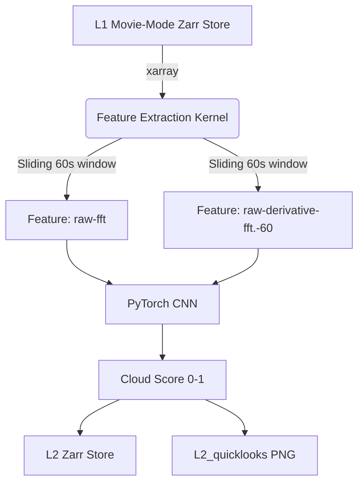
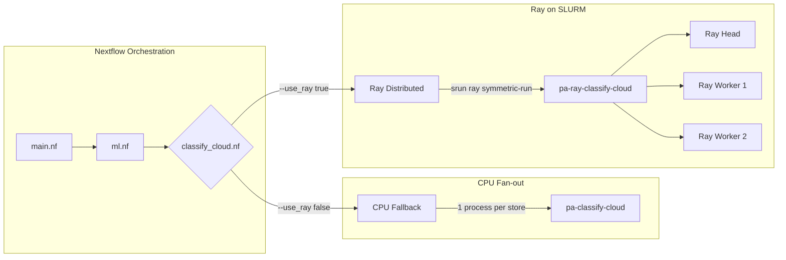

# Machine Learning Architecture & Pipelines

This document outlines the architecture of the Machine Learning workloads in `panoseti_analysis`, focusing primarily on the Cloud Detection inference pipeline, the Nextflow-to-Ray substrate, and future extensions.

## Data Flow & Inference Pipeline

The ML pipeline is architected around "Pure Kernels" (Layer A) that operate independently of any transport or orchestration framework, wrapped by thin CLI adapters (Layer B) that handle data loading and distribution.

### Feature Extraction
The feature extraction logic accurately reproduces the pipeline originally defined in the `panoseti-software/cloud-detection` repository:
1. **Cadence & Windowing**: Instead of rigid chunking, the pipeline uses a *rolling window* parametrized by `cadence_s`. For any target time $T$, it looks back 60 seconds.
2. **Preprocessing**: 
   - Uses a 2D Hann window (`np.hanning(32)`).
   - Computes `np.fft.fftn` and `np.fft.fftshift`.
   - Scales the FFT magnitude with `np.log()`.
3. **Integration**: The model expects input frames integrated over $1\text{ms}$. Since Panoseti `img` natively records at $100\mu\text{s}$, the kernel sums $10$ consecutive frames to produce the final `curr_img` and `prev_img` arrays before taking differences and FFTs.

## Execution Models: Nextflow + Ray

Because Python data-science libraries (like PyTorch and xarray) are notoriously difficult to parallelize cleanly via Nextflow alone (due to high initialization overhead and memory fragmentation), we support a dual-execution strategy: **CPU Fallback** and **Distributed Ray**.

### 1. CPU Fallback (`pa-classify-cloud`)
- **How it works**: Nextflow fans out `L1` stores, spawning one independent SLURM/local job per store. Each job boots a Python interpreter, loads the model, and runs inference.
- **Tradeoffs**: Extremely reliable and container-native, but suffers from high "cold-start" latency (loading PyTorch and model weights over the network for every single 1-minute data file).

### 2. Distributed Ray (`pa-ray-classify-cloud`)
- **How it works**: Nextflow groups all stores belonging to a single observation run and submits a *single* `srun` job requesting multiple nodes. The `ray symmetric-run` wrapper bootstraps a transient Ray cluster across the SLURM allocation.
- **Tradeoffs**: The PyTorch model is loaded *once* and cached in Ray's object store. Inference tasks are dispatched to workers continuously with near-zero overhead. This is the optimal route for large-scale "movie-mode" processing.

## Extending the ML Substrate (Placeholders)

The current architecture exclusively handles **Batch Inference**. However, the Ray substrate provides an excellent foundation for future ML lifecycle tasks.

### 1. Training (`Ray Train`)
*Placeholder*: Future workloads could integrate `Ray Train` to perform distributed data-parallel training on the Expanse GPU partition.
- **Implementation Path**: A new CLI adapter (e.g., `pa-train-cloud`) would use `ray.train.torch.TorchTrainer` to distribute the `CloudDetection` PyTorch module across multiple GPUs. 

### 2. Hyperparameter Tuning (`Ray Tune`)
*Placeholder*: `Ray Tune` can seamlessly wrap the `Ray Train` loop to perform grid search or Bayesian optimization over model architectures and hyperparameters.
- **Implementation Path**: Define a searchable hyperparameter space in the Typer CLI, and pass it to a `TuneConfig`.

### 3. Real-time Serving (`Ray Serve`)
*Placeholder*: If real-time cloud detection is required at the observatory (Lick/Palomar), `Ray Serve` could be deployed on a persistent edge node.
- **Implementation Path**: Wrap the `predict_cloud_score` pure kernel inside a `@serve.deployment` class. The DAQ network would send HTTP or gRPC requests containing raw PFF buffers, and the Ray Serve endpoint would return real-time `cloud_score` JSON payloads.
